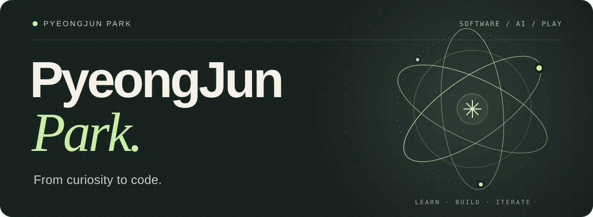
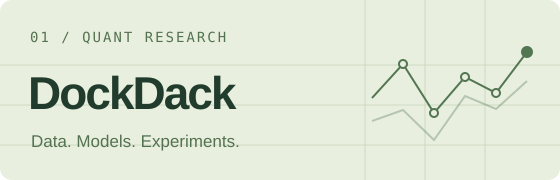
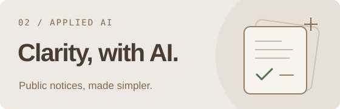

  

  <strong>Software student at Kwangwoon University.</strong> 
  Exploring deep learning, building with Python, and experimenting with Unity.

  <a href="mailto:pjme2004@gmail.com">Email ↗</a>
  &nbsp;&nbsp;·&nbsp;&nbsp;
  <a href="https://www.youtube.com/@PJUNTE">YouTube / PJTeacher ↗</a>
  &nbsp;&nbsp;·&nbsp;&nbsp;
  <a href="https://github.com/PyeongJunPark?tab=repositories">Repositories ↗</a>

 

### Selected work

<table>
  <tr>
    <td width="50%" valign="top">
      
      <h3><a href="https://github.com/PyeongJunPark/dockdack">DockDack ↗</a></h3>
      
A research workbench for market data, model experiments, backtesting, and paper trading.

      
<code>Python</code> <code>PySide6</code> <code>Quant Research</code>

    </td>
    <td width="50%" valign="top">
      
      <h3><a href="https://github.com/2026-KW-HACKATHON/02_Cotton-Candy-and-Raccoon">Cotton Candy &amp; Raccoon ↗</a></h3>
      
A 2026 KW Hackathon team project. My contributions: Gemini summaries, plain-language Korean, and source-linked notice cards.

      
<code>Python</code> <code>Gemini</code> <code>PostgreSQL</code>

    </td>
  </tr>
</table>

 

### Tools &amp; interests

**Languages** &nbsp; `Python` &nbsp; `C` &nbsp; `C++` &nbsp; `C#` 
**Building with** &nbsp; `Unity` &nbsp; `PySide6` 
**Exploring** &nbsp; Deep learning · AI applications · Quantitative research

 

---

Always learning. Always making something.

